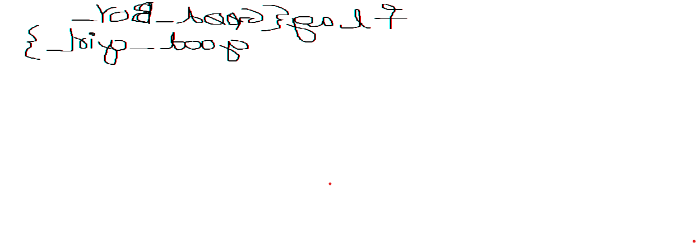

## Lab 1

### Description
My sister's computer crashed. We were very fortunate to recover this memory dump. Your job is get all her important files from the system. From what we remember, we suddenly saw a black window pop up with some thing being executed. When the crash happened, she was trying to draw something. Thats all we remember from the time of crash.

**Note**: This challenge is composed of 3 flags.

First we get info on the system using imageinfo


### Flag 1: 

We can check the cmd line history from the console information using consoles to know what happened in the command line


We can see a weird string over there....we base64 it and we get the flag we want.

### Flag2:


so as it is stated as important file we can grep the keyword
```
python2 vol.py -f /mnt/c/Users/barsh/Downloads/Bi0s/MemLabs-Lab1/MemoryDump_Lab1.raw --profile=Win7SP1x64 filescan | grep -i important
```
now we dump the file using dump files


We are asked for a pass to view so we extract the hashes using hashdump


Putting the NTML hash in caps and passing it will reveal the file and we get the first flag


### Flag 3:

Let us see the processes that were run in the system using pslist.


we can see paint.exe was run in the system 


So we dump the process using memdump and the process id of the process to analyse it : 


No analyse this file we can use GIMP and adjusting the height and width and changing the offsets we can manage to get our flag.



**Thankyou for reading my writeup for Memlabs Lab-1**