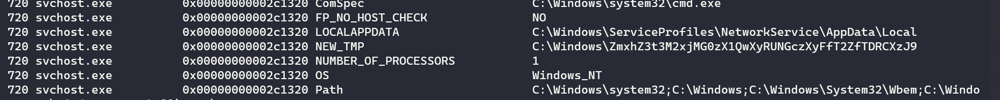
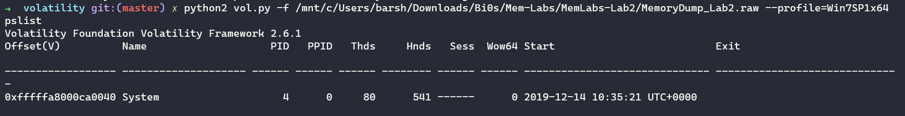
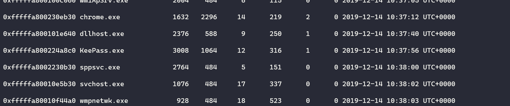
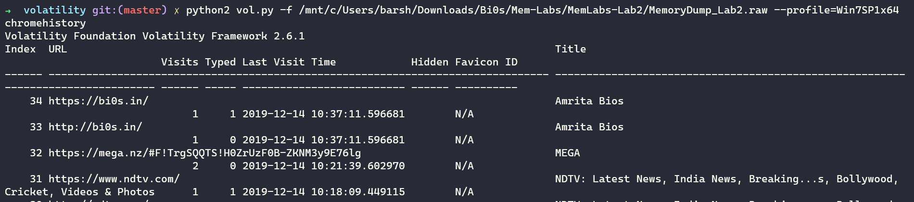

## Lab-2

### Description

One of the clients of our company, lost the access to his system due to an unknown error. He is supposedly a very popular "environmental" activist. As a part of the investigation, he told us that his go to applications are browsers, his password managers etc. We hope that you can dig into this memory dump and find his important stuff and give it back to us.

**Note: This challenge is composed of 3 flags.**

### Flag 1:

As we see the word enviromental is highlighted so the flag might me related so we check out the enviromental variables of the system using the envars command

we can see a string.....looks like a Base64...so let's decode and we get our first flag.

### Flag 2:

For the second flag the user tells us to check out his browsers and password managers as a hint....so let's take a look at his processes

And we see Keepass which as a open source password manager...could be useful...

As we know that keepass database has an extension of kdbx so let's try grepping it in file scan and dump it

Now it asks us for a masterkey which we have no clue of..let's try grepping keywords like password or key...while grepping password we get a password.png file in the filescan

Dumping that we get a file where the pass is said in the left bottom corner...putting that we get a lot entries...one of them is flag we right-click it and get the flag from it.

### Flag 3:

For the last flag the client tells us to look through his browsers so we can see chrome is his most extensively used browser....so let's install a plugin for that in volatility known as chromehistory.py

running that command we get the chrome history:

We can see a MEGA link following it we get a zipped PNG file which we can open using the flag used in Lab - 1...If you still haven't completed that refer to my Lab-1 writeup.

Now we have all three flags...thanks for reading