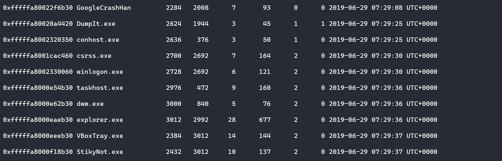
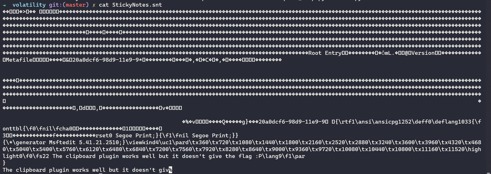
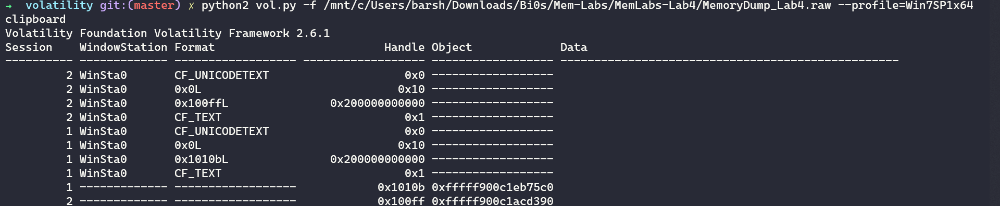
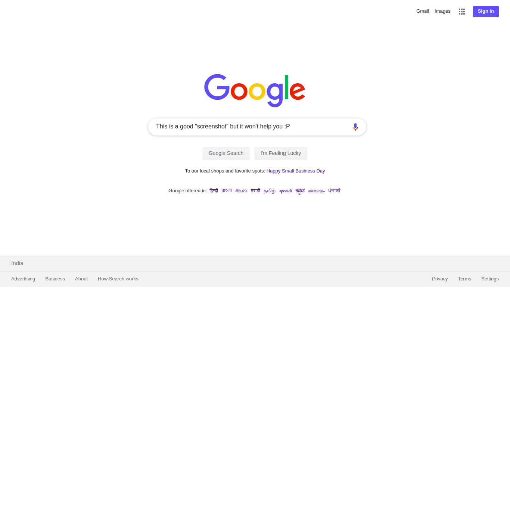
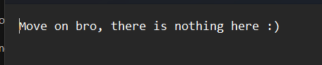
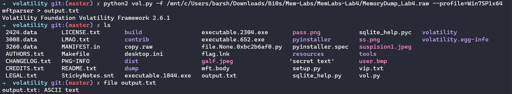

## Lab-4

### Description:

My system was recently compromised. The Hacker stole a lot of information but he also deleted a very important file of mine. I have no idea on how to recover it. The only evidence we have, at this point of time is this memory dump. Please help me.

**Note: This challenge is composed of only 1 flag.**

The flag format for this lab is: inctf{s0me_l33t_Str1ng}

### Flag :

So for this challenge the description tells us his information was deleted by a hacker so let's take a look at his files....we first run pslist on the dump : 

We can see we have a StickyNot process running so let's find a file for that in file scan....after getting the file we open it but the flag isn't there.....well but there's something about clip board

So let's run the clip board plugin...

Still nothing it seems

Let's look into the most targeted folders like desktop....we found two images over there...one of them is halfed it seems...let's manually change it's height and width to get the complete image....we have it but no flag

For the second image....as it's a jpeg let's run steghide on it....okay we have a text filee

Still no flag :(

As the client says that the info deleted was important let's try grepping the keyword important...and we get a file called important.txt...but we are not able to grep it cause it's deleted

Okay as the Desc says the info was deleted....let's check out mftparser as we know what mft stores metadata on all the files on the system even if after they are deleted...let's flush all the data to a txt file

After that searching for the IMPORTANT.txt file which we looked up earlier gave us the flag :p

**f{1_is_n0t_EQu4l_7o_2_bUt_yh1s_d0s3nt_m4ke_s3ns3}**