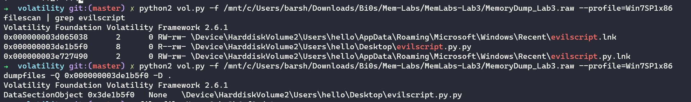
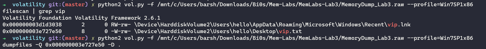
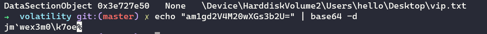
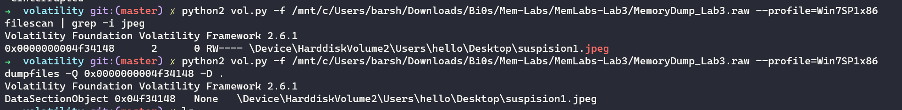
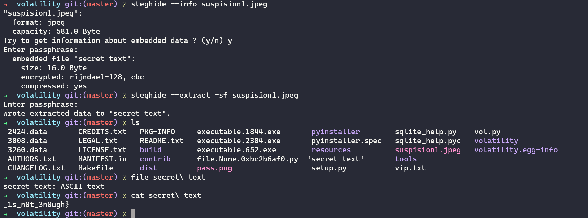

## Lab-3

### Description:

A malicious script encrypted a very secret piece of information I had on my system. Can you recover the information for me please?

Note-1: This challenge is composed of only 1 flag. The flag split into 2 parts.

Note-2: You'll need the first half of the flag to get the second.

You will need this additional tool to solve the challenge,

```
$ sudo apt install steghide
```
The flag format for this lab is: inctf{s0me_l33t_Str1ng}

### Final Flag:

So for this challenge the flag is divided into two parts...so for the first part it says that the malicious code encrypts the info....so let's say it's a .py script.

so let's try to look for em

after grepping for .py we get a file named evil-script...



having a look at the script...it xors a string and then b64 it...so we need to find the output of the code...
It's say it output's as vip.txt....sp let's try to find it and dump it



Now let's base64 it and XOR it




Now we have the first part...

Ok for the second part....

We are told we need to use steghide for the challenge so let's try to get the jpg or jpeg filesss



Now we use steghide...and use the first part of the flag as the passphrase....And there u go we get the second part as well...



**Thankyou for reading**